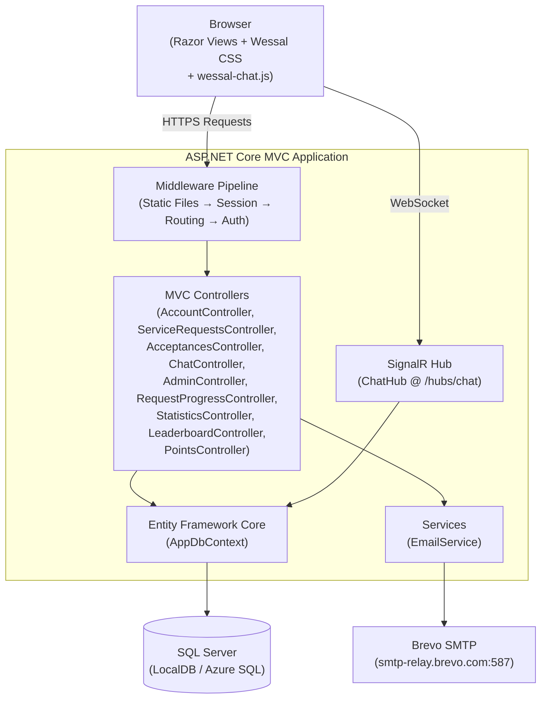

# System Architecture — وصال (Wessal)

## High-Level Architecture

Wessal is a **monolithic ASP.NET Core MVC** application. All layers (UI, business logic, data access) live in a single deployable unit. There is no separate frontend SPA or external API.



---

## Request Processing Pipeline

Every HTTP request passes through the following middleware chain, in order:

```mermaid
flowchart LR
    A[Incoming HTTPS Request] --> B[UseHttpsRedirection]
    B --> C[UseStaticFiles]
    C --> D[UseRouting]
    D --> E[UseSession]
    E --> F[UseAuthorization]
    F --> G[MapHub /hubs/chat]
    G --> H[MapControllerRoute]
    H --> I[Controller Action]
    I --> J[Razor View Rendered]
    J --> K[HTTP Response]
```



**Key notes:**
- `UseSession` runs **after** routing. Sessions use in-memory distributed cache (development only — not suitable for multi-server production).
- There is no `UseAuthentication()` call because the app uses manual session checks, not ASP.NET Core Identity.
- Static files are served directly by `UseStaticFiles` without hitting controllers.

---

## Layered Architecture

| Layer | Location | Responsibility |
|-------|----------|----------------|
| **Presentation** | `Views/` | Razor templates, HTML, CSS classes |
| **Application** | `Controllers/` | HTTP handling, orchestration, session checks |
| **Domain** | `Models/` | Entities, enums, database context |
| **Infrastructure** | `Services/`, `Hubs/` | External services (email, real-time) |
| **Data** | `Migrations/`, `AppDbContext` | Schema definition and EF queries |

> **Note:** There is no explicit **Service Layer** between controllers and EF Core. Controllers query the database directly via `_db`. This reduces ceremony but increases coupling and makes testing harder.

---

## Localization & Culture

The app is configured to run in Arabic culture by default:

```csharp
// Program.cs
var supportedCultures = new[] { new CultureInfo("ar"), new CultureInfo("ar-EG") };
var localizationOptions = new RequestLocalizationOptions
{
    DefaultRequestCulture = new RequestCulture("ar-EG"),
    SupportedCultures = supportedCultures,
    SupportedUICultures = supportedCultures
};
app.UseRequestLocalization(localizationOptions);
```

This ensures:
- Number formatting follows Arabic conventions
- Date formatting uses the Arabic calendar where applicable
- The base `html` element is `dir="rtl"` (set via `wessal.css`)

---

## Session Management

Sessions are the only authentication mechanism:

| Session Key | Type | Purpose |
|-------------|------|---------|
| `UserId` | `int` | Authenticated user ID |
| `UserName` | `string` | Display name in navbar |
| `IsAdmin` | `string` | Admin access flag (`"true"`) |
| `AdminLoggedIn` | `string` | Admin login state (`"true"`) |
| `PendingUser_*` | `string` | Temporary registration data (5 keys) |

Session timeout: **60 minutes** (configurable in `Program.cs`).

---

## Dependency Injection Registration

```csharp
builder.Services.AddControllersWithViews();
builder.Services.AddSignalR();
builder.Services.AddDistributedMemoryCache();
builder.Services.AddSession(options => { ... });
builder.Services.AddScoped<EmailService>();
builder.Services.AddDbContext<AppDbContext>(options =>
    options.UseSqlServer(connectionString));
builder.Services.AddLocalization(...);
```

`EmailService` is scoped per-request. `AppDbContext` is also scoped per-request (EF Core default). The `ChatHub` uses `IServiceScopeFactory` to create its own database scope since hubs have a different lifetime.

---

## Scalability Concerns

| Concern | Current Behavior | Recommendation |
|---------|-----------------|----------------|
| **Session Storage** | `AddDistributedMemoryCache()` — in-process only | Use Redis for multi-server deployments |
| **Image Storage** | Local filesystem `/wwwroot/uploads/` | Use Azure Blob Storage or similar |
| **SignalR Backplane** | None — single server only | Add Redis backplane for scale-out |
| **Admin Auth** | Plaintext credentials in `appsettings.json` | Use environment secrets or Key Vault |
| **N+1 Queries** | Some controllers call `_db.Users.Find()` in a loop (Statistics) | Refactor to bulk-load with `Include` |
