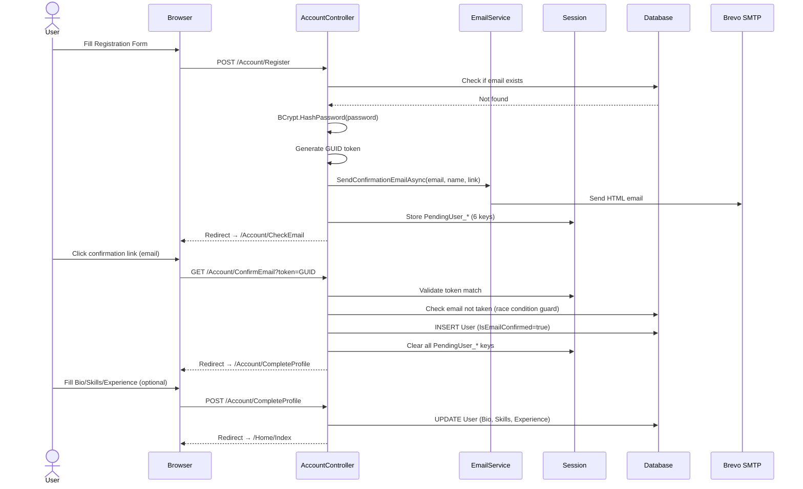
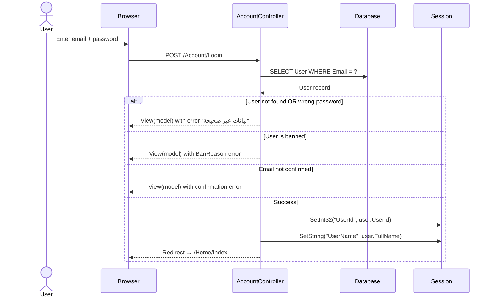

# Authentication Flow — وصال (Wessal)

## Overview

Wessal uses a **fully custom session-based authentication** system — no ASP.NET Core Identity, no JWT, no OAuth. All auth state is managed via `ISession`.

---

## Registration Flow



### Key Security Notes
- The password hash is stored in session (not the plaintext) while awaiting email confirmation
- The session token is a cryptographically random GUID
- A race condition guard re-checks email uniqueness at the moment of database insertion
- After confirmation, all pending session data is explicitly removed

---

## Login Flow



---

## Authorization Gate Pattern

Every protected controller action uses this pattern (no middleware attribute):

```csharp
private int? GetUserId() => HttpContext.Session.GetInt32("UserId");

public IActionResult MyProtectedAction()
{
    var userId = GetUserId();
    if (userId == null) return RedirectToAction("Login", "Account");
    // proceed...
}
```

**This means:**
- There is **no global authorization filter** — each action must check manually
- A forgotten `GetUserId()` check would silently expose a page to unauthenticated users
- There is no `[Authorize]` attribute usage anywhere in the project

---

## Admin Authentication

Admin is a separate, parallel auth system:

```csharp
// AdminController.cs
private IActionResult? ValidateAdminAccess()
{
    var isAdmin = HttpContext.Session.GetString("IsAdmin");
    var adminLoggedIn = HttpContext.Session.GetString("AdminLoggedIn");
    if (isAdmin != "true" || adminLoggedIn != "true") 
        return RedirectToAction("Login");
    return null;
}
```

Admin credentials are read from `appsettings.json`:

```json
"AdminSettings": {
    "Email": "admin@volunteerbridge.com",
    "Password": "Admin123"
}
```

> ⚠️ **Critical Security Issues:**
> 1. Admin password is **plaintext** in configuration — must be changed before any production deployment
> 2. Admin and regular user sessions share the same session store — a regular user who guesses the session key names could spoof admin access (though this requires server-side session manipulation)
> 3. There is no CSRF protection on the admin login form beyond the `[ValidateAntiForgeryToken]` attribute (which is correctly applied)

---

## Logout

```csharp
public IActionResult Logout()
{
    HttpContext.Session.Clear(); // Clears ALL session data
    return RedirectToAction("Login");
}
```

Both user and admin logout call `Session.Clear()`. This is correct — the entire session is invalidated.

---

## Session Configuration

```csharp
builder.Services.AddSession(options =>
{
    options.IdleTimeout = TimeSpan.FromMinutes(60);
    options.Cookie.HttpOnly = true;   // XSS protection
    options.Cookie.IsEssential = true; // GDPR compliance (no consent required)
});
```

- Session ID is stored in an HttpOnly cookie (not accessible from JavaScript)
- 60-minute idle timeout
- Uses in-memory distributed cache — **sessions are lost on app restart**

---

## Email Confirmation Service

`EmailService` is registered as **Scoped** and injected into `AccountController`:

```csharp
// Services/EmailService.cs
await smtp.ConnectAsync(host, port, SecureSocketOptions.StartTls);
await smtp.AuthenticateAsync(username, password);
await smtp.SendAsync(email);
```

- SMTP provider: **Brevo** (smtp-relay.brevo.com:587)
- Connection uses **STARTTLS** (port 587)
- If SMTP fails, the exception propagates to the controller and registration is blocked
- The confirmation email is HTML with Arabic text and a green CTA button

---

## Known Weaknesses & Recommendations

| Issue | Risk | Recommendation |
|-------|------|----------------|
| No `[Authorize]` attribute | Medium | Add a global `AuthorizationFilter` or migrate to ASP.NET Core Identity |
| Admin plaintext password | High | Store hashed or use environment variable / Azure Key Vault |
| Edit profile changes email without re-auth | Medium | Require current password for sensitive field changes |
| Session-only auth (lost on restart) | Low (dev) / High (prod) | Use Redis or SQL Server session store for production |
| No rate limiting on login | Medium | Add `Microsoft.AspNetCore.RateLimiting` middleware |
