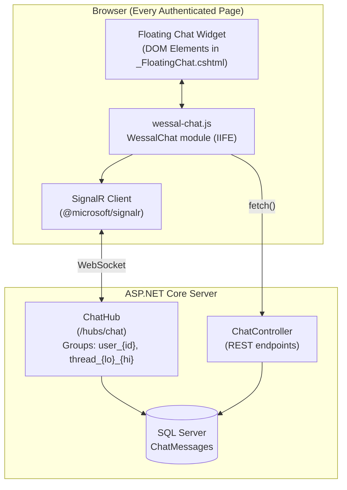
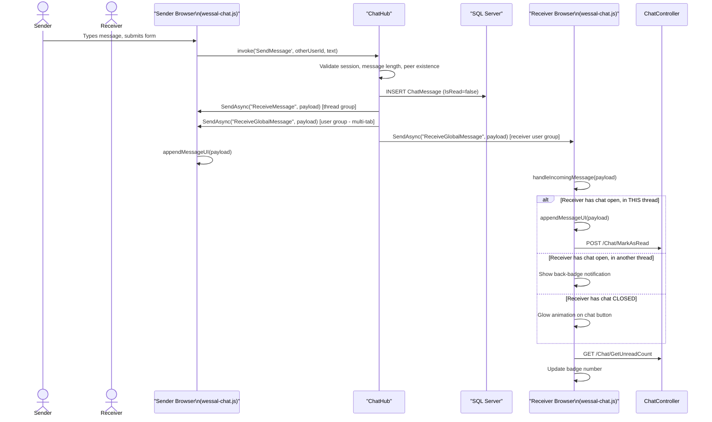

# SignalR Chat Architecture — وصال (Wessal)

## Overview

Wessal implements a **real-time, persistent, floating chat widget** powered by **ASP.NET Core SignalR**. The chat system consists of:

1. **`ChatHub.cs`** — Server-side SignalR hub
2. **`ChatController.cs`** — REST API endpoints for chat data
3. **`wessal-chat.js`** — Client-side widget logic and SignalR connection
4. **`_FloatingChat.cshtml`** — HTML structure of the widget (rendered in `_Layout.cshtml`)
5. **`wessal-chat.css`** — Chat widget styles
6. **`ChatMessages` table** — Persistent message storage

---

## Architecture Overview



---

## SignalR Hub — `ChatHub.cs`

### Hub URL
```
/hubs/chat
```
Registered in `Program.cs`:
```csharp
app.MapHub<ChatHub>("/hubs/chat");
```

### Group Strategy

The hub uses **two group types** for targeted message delivery:

| Group Name | Format | Purpose |
|-----------|--------|---------|
| User Global Group | `user_{userId}` | Receives all messages directed to a user (badge updates) |
| Thread Group | `thread_{lo}_{hi}` | Receives messages in a specific conversation (lo < hi, ensures uniqueness) |

### Hub Methods

#### `OnConnectedAsync()`
```csharp
// Every connection is added to the user's personal group
await Groups.AddToGroupAsync(ConnectionId, $"user_{userId}");
```
Called automatically when the SignalR connection is established.

#### `JoinThread(int otherUserId)`
```csharp
// Adds the current connection to the thread group
await Groups.AddToGroupAsync(ConnectionId, ThreadGroupName(userId, otherUserId));
```
Called when the user opens a chat thread (navigates to a conversation).

#### `SendMessage(int otherUserId, string message)`
Validates:
- User is authenticated (via session)
- Not messaging themselves
- Message is not empty and ≤ 2000 chars
- Receiver exists in the database

Then:
1. Creates and saves a `ChatMessage` entity to the database
2. Broadcasts `ReceiveMessage` to the **thread group** (both participants in the thread view)
3. Broadcasts `ReceiveGlobalMessage` to the **receiver's user group** (badge + inbox update)
4. Broadcasts `ReceiveGlobalMessage` to the **sender's user group** (multi-tab sync)

---

## Message Flow — Send & Receive



---

## REST API Endpoints (ChatController)

| Method | Route | Description |
|--------|-------|-------------|
| `GET` | `/Chat/Inbox?activeUserId=N` | Full inbox page view |
| `GET` | `/Chat/Thread?otherUserId=N` | Redirects to Inbox with active thread |
| `GET` | `/Chat/History?otherUserId=N` | Returns JSON array of messages for a thread |
| `GET` | `/Chat/GetRecentConversations` | Returns JSON list of inbox rows |
| `GET` | `/Chat/GetUnreadCount` | Returns `{ unreadCount: N }` |
| `POST` | `/Chat/MarkAsRead?otherUserId=N` | Marks all messages in a conversation as read |

### Inbox Data Structure (`ChatInboxRowViewModel`)
```csharp
public class ChatInboxRowViewModel
{
    public int OtherUserId { get; set; }
    public string OtherUserName { get; set; }
    public DateTime LastMessageAt { get; set; }
    public string LastMessagePreview { get; set; }  // Truncated to 120 chars
    public int UnreadCount { get; set; }
}
```

---

## Client-Side Widget — `wessal-chat.js`

The entire chat widget logic is an **IIFE (Immediately Invoked Function Expression)** exposing a clean public API:

```javascript
window.WessalChat = (function() {
    // Internal state (closure)
    let isOpen, currentView, activeThreadUserId, connection, currentUserId;
    
    // Public API
    return {
        init: init,          // Initialize with userId, connect SignalR
        openThread: openThread, // Open a specific chat thread
        toggle: toggleChat   // Toggle widget visibility
    };
})();
```

### State Persistence
Chat state (open/closed, current view, active thread) persists across page navigations using `sessionStorage`:

```javascript
const STATE_KEY = 'wessal_chat_state';
// Expires after 30 minutes of inactivity
```

### Date/Time Formatting
All timestamps are formatted in Arabic using `Intl.DateTimeFormat`:

```javascript
const arabicFormatter = {
    time: new Intl.DateTimeFormat('ar-EG', { hour: 'numeric', minute: '2-digit', hour12: true }),
    date: new Intl.DateTimeFormat('ar-EG', { day: 'numeric', month: 'long' }),
    fullDate: new Intl.DateTimeFormat('ar-EG', { day: 'numeric', month: 'long', year: 'numeric' })
};
```

### Message Grouping
Consecutive messages from the same sender are visually grouped using CSS classes:
- `group-standalone` — single message from a sender
- `group-first` — first in a sequence
- `group-middle` — middle of a sequence
- `group-last` — last in a sequence

Day boundary separators are injected between messages from different dates.

---

## Floating Widget HTML Structure (`_FloatingChat.cshtml`)

```html
<div id="w-floating-chat-container">
    <!-- Floating trigger button with unread badge -->
    <button id="w-floating-chat-btn">
        <span id="w-floating-chat-badge">0</span>
    </button>
    
    <!-- Chat window -->
    <div id="w-chat-window" class="d-none">
        <!-- Inbox view -->
        <div id="w-chat-inbox-view">
            <div id="w-chat-inbox-list"><!-- dynamic --></div>
        </div>
        
        <!-- Thread view -->
        <div id="w-chat-thread-view">
            <div id="w-chat-messages"><!-- dynamic --></div>
            <form id="w-chat-form">
                <input id="w-chat-input" />
            </form>
        </div>
    </div>
</div>
```

The widget is initialized in `_Layout.cshtml`:
```javascript
// Only initialized for logged-in users
WessalChat.init(@Html.Raw(userId));
```

---

## Known Limitations

| Issue | Impact | Recommendation |
|-------|--------|----------------|
| No message pagination | Loading 2000 messages max per thread | Implement cursor-based pagination |
| No typing indicators | Minor UX gap | Emit `isTyping` SignalR events |
| No message deletion | Messages permanent | Add soft-delete with `IsDeleted` flag |
| No image/file sharing | Text-only | Add file upload endpoint |
| Chat inbox limited to 2000 msgs across all conversations | Data loss risk | Replace with proper pagination |
| No XSS sanitization on `msg.message` in JS | Security risk | Use `textContent` instead of `innerHTML` for message text |
