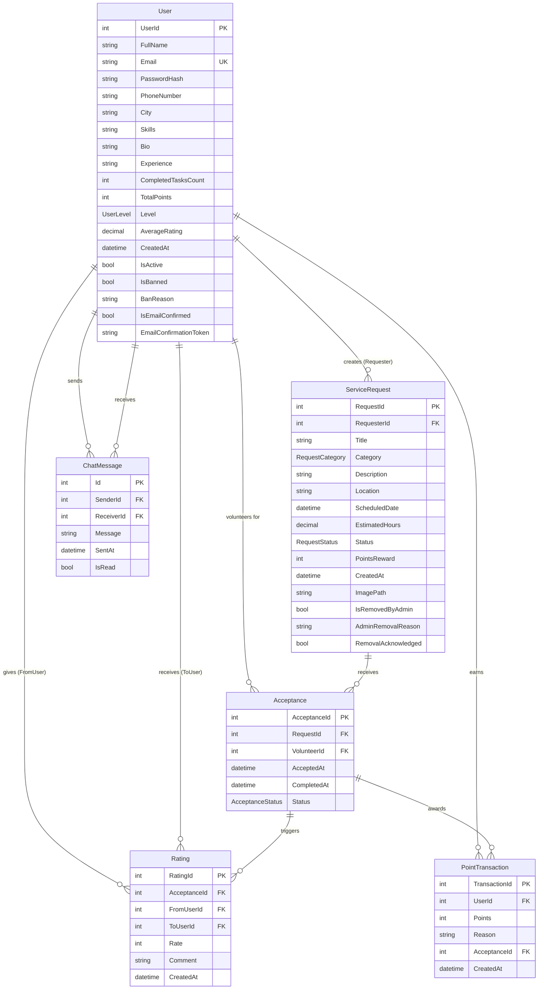

# Database Schema — وصال (Wessal)

## Overview

Wessal uses **SQL Server** (LocalDB for development, configurable for production) via **Entity Framework Core 9**. The database is named `VolunteerBridge` and contains **6 tables**.

Connection string (development):
```
Server=(localdb)\MSSQLLocalDB;Database=VolunteerBridge;
Trusted_Connection=True;MultipleActiveResultSets=true;TrustServerCertificate=True
```

---

## Entity-Relationship Diagram



---

## Table Details

### `Users`

| Column | Type | Constraints | Notes |
|--------|------|-------------|-------|
| `UserId` | `int` | PK, Identity | Auto-incremented |
| `FullName` | `nvarchar(100)` | NOT NULL | |
| `Email` | `nvarchar(150)` | NOT NULL, **UNIQUE INDEX** | Enforced at DB level |
| `PasswordHash` | `nvarchar(255)` | NOT NULL | BCrypt hash (60 chars) |
| `PhoneNumber` | `nvarchar(20)` | NOT NULL | |
| `City` | `nvarchar(100)` | NULL | |
| `Skills` | `nvarchar(500)` | NULL | Free-text, not structured |
| `Bio` | `nvarchar(1000)` | NULL | |
| `Experience` | `nvarchar(MAX)` | NULL | No length constraint |
| `CompletedTasksCount` | `int` | NOT NULL, default `0` | |
| `TotalPoints` | `int` | NOT NULL, default `0` | |
| `Level` | `int` | NOT NULL, default `0` | Enum: 0=Newcomer…3=Champion |
| `AverageRating` | `decimal(3,2)` | NOT NULL, default `0` | 0.00–5.00 |
| `CreatedAt` | `datetime2` | NOT NULL, default `UtcNow` | |
| `IsActive` | `bit` | NOT NULL, default `true` | Not currently enforced in queries |
| `IsBanned` | `bit` | NOT NULL, default `false` | |
| `BanReason` | `nvarchar(500)` | NULL | |
| `IsEmailConfirmed` | `bit` | NOT NULL, default `false` | |
| `EmailConfirmationToken` | `nvarchar(MAX)` | NULL | GUID string, set to NULL after confirmation |

---

### `ServiceRequests`

| Column | Type | Constraints | Notes |
|--------|------|-------------|-------|
| `RequestId` | `int` | PK, Identity | |
| `RequesterId` | `int` | FK → Users, RESTRICT delete | |
| `Title` | `nvarchar(150)` | NOT NULL | |
| `Category` | `int` | NOT NULL | Enum: 0=Community…9=Other |
| `Description` | `nvarchar(MAX)` | NOT NULL | |
| `Location` | `nvarchar(200)` | NOT NULL | Free-text (city/area) |
| `ScheduledDate` | `datetime2` | NOT NULL | |
| `EstimatedHours` | `decimal(4,1)` | NOT NULL | Range 0.1–999.9 |
| `Status` | `int` | NOT NULL, default `0` | 0=Open, 1=Accepted, 2=Completed, 3=Cancelled |
| `PointsReward` | `int` | NOT NULL | = max(10, estimatedHours × 20) |
| `CreatedAt` | `datetime2` | NOT NULL, default `UtcNow` | |
| `ImagePath` | `nvarchar(MAX)` | NULL | e.g., `/uploads/guid.jpg` |
| `IsRemovedByAdmin` | `bit` | NOT NULL, default `false` | Soft delete flag |
| `AdminRemovalReason` | `nvarchar(MAX)` | NULL | |
| `RemovalAcknowledged` | `bit` | NOT NULL, default `false` | User has seen the removal notice |

---

### `Acceptances`

| Column | Type | Constraints | Notes |
|--------|------|-------------|-------|
| `AcceptanceId` | `int` | PK, Identity | |
| `RequestId` | `int` | FK → ServiceRequests, CASCADE delete | |
| `VolunteerId` | `int` | FK → Users, RESTRICT delete | |
| `AcceptedAt` | `datetime2` | NOT NULL, default `UtcNow` | |
| `CompletedAt` | `datetime2` | NULL | Set when volunteer marks done |
| `Status` | `int` | NOT NULL, default `0` | 0=Pending, 1=InProgress, 2=Done, 3=Cancelled |

---

### `Ratings`

| Column | Type | Constraints | Notes |
|--------|------|-------------|-------|
| `RatingId` | `int` | PK, Identity | |
| `AcceptanceId` | `int` | FK → Acceptances, CASCADE delete | |
| `FromUserId` | `int` | FK → Users, RESTRICT delete | Requester |
| `ToUserId` | `int` | FK → Users, RESTRICT delete | Volunteer |
| `Rate` | `int` | NOT NULL | 1–5 |
| `Comment` | `nvarchar(500)` | NULL | |
| `CreatedAt` | `datetime2` | NOT NULL, default `UtcNow` | |

---

### `PointTransactions`

| Column | Type | Constraints | Notes |
|--------|------|-------------|-------|
| `TransactionId` | `int` | PK, Identity | |
| `UserId` | `int` | FK → Users, CASCADE delete | |
| `Points` | `int` | NOT NULL, Range ≥ 1 | |
| `Reason` | `nvarchar(200)` | NULL | e.g., "اكتمل: Request Title" |
| `AcceptanceId` | `int` | FK → Acceptances, SET NULL | Nullable — decouples if acceptance deleted |
| `CreatedAt` | `datetime2` | NOT NULL, default `UtcNow` | |

---

### `ChatMessages`

| Column | Type | Constraints | Notes |
|--------|------|-------------|-------|
| `Id` | `int` | PK, Identity | |
| `SenderId` | `int` | FK → Users, RESTRICT delete | |
| `ReceiverId` | `int` | FK → Users, RESTRICT delete | |
| `Message` | `nvarchar(MAX)` | NOT NULL | Max 2000 chars enforced in Hub |
| `SentAt` | `datetime2` | NOT NULL | Set in Hub (UTC) |
| `IsRead` | `bit` | NOT NULL, default `false` | |

---

## Delete Behavior Summary

| Relationship | On Parent Delete |
|-------------|-----------------|
| User → ServiceRequests | RESTRICT |
| ServiceRequest → Acceptances | CASCADE |
| User → Acceptances | RESTRICT |
| Acceptance → Ratings | CASCADE |
| User (From/To) → Ratings | RESTRICT |
| User → PointTransactions | CASCADE |
| Acceptance → PointTransactions | SET NULL |
| User (Sender/Receiver) → ChatMessages | RESTRICT |

> **Design Note:** The RESTRICT pattern on most User relationships means you cannot delete a user who has created requests, accepted tasks, or exchanged messages. There is currently no user deletion feature, making this safe in practice.

---

## Missing / Weak Schema Areas

1. **`Experience` field** on `User` has no `StringLength` constraint in the model annotation — unlimited text is allowed.
2. **No unique constraint** on `(RequestId, VolunteerId)` in `Acceptances` — the duplicate check is done in application code only.
3. **No index** on `ChatMessages (SenderId, ReceiverId, SentAt)` — conversation history queries will perform full table scans as data grows.
4. **No soft-delete on Users** — banned users remain in the database and their relations intact.
