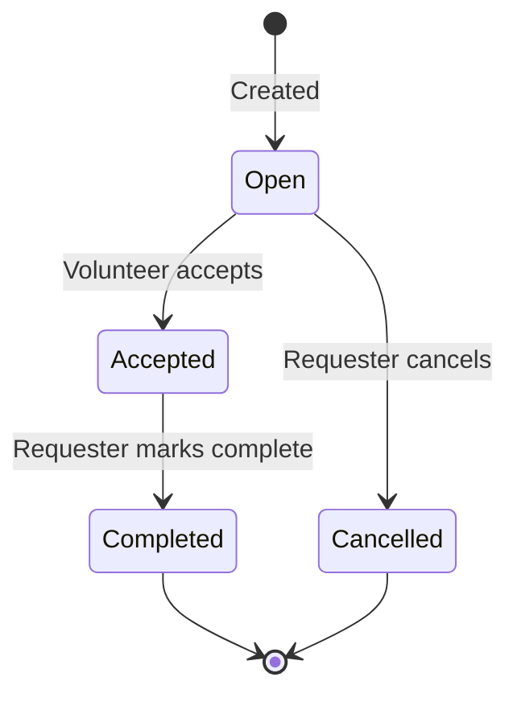

# Service Requests — Feature Documentation

## Overview

The Service Requests feature is the **core value flow** of Wessal — it allows users to post help requests and for volunteers to accept them. Managed by `ServiceRequestsController`.

---

## Request Categories (10 Types)

| Enum Value | Arabic | English |
|-----------|--------|---------|
| 0 | مجتمعي | Community |
| 1 | تعليمي | Education |
| 2 | تقني | Tech |
| 3 | صحي | Healthcare |
| 4 | بيئي | Environment |
| 5 | فعاليات | Events |
| 6 | إنساني | Humanitarian |
| 7 | إرشاد | Mentorship |
| 8 | رعاية الحيوانات | Animal Welfare |
| 9 | أخرى | Other |

---

## Creating a Service Request

**Route:** `POST /ServiceRequests/Create`

**ViewModel:** `CreateRequestViewModel`

Fields:
- `Title` (required, max 150 chars)
- `Category` (required — from enum above)
- `Description` (required)
- `Location` (required, max 200 chars)
- `ScheduledDate` (required)
- `EstimatedHours` (required, 0.1–999.9)
- `Image` (optional — `IFormFile`)

**Points Calculation:**
```csharp
PointsReward = Math.Max(10, (int)(model.EstimatedHours * 20));
```
Minimum 10 points; 1 hour = 20 points; 5 hours = 100 points.

**Image Upload Flow:**
1. Validate extension: `.jpg`, `.jpeg`, `.png`, `.gif`, `.webp`
2. Generate GUID filename
3. Save to `/wwwroot/uploads/{guid}.ext`
4. Store `/uploads/{guid}.ext` in `ServiceRequest.ImagePath`

---

## Browsing & Filtering Requests

**Route:** `GET /ServiceRequests/Browse`

Only shows requests where:
- `Status == Open`
- `IsRemovedByAdmin == false`

**Query Parameters:**
- `searchTerm` — searches `Title` and `Description` (contains, case-insensitive at DB level)
- `category` — integer enum value
- `city` — matches against `Location` field (contains)

Results are ordered by `CreatedAt` descending (newest first).

---

## Request Status Machine



**Important:** There is no transition from `Accepted` back to `Open` (no volunteer withdrawal mechanism). This is a known limitation.

---

## Admin Soft-Delete

Admins can remove a request without physically deleting it:

```csharp
request.IsRemovedByAdmin = true;
request.AdminRemovalReason = reason;
```

- The request disappears from the Browse feed
- The request remains visible in `MyRequests` with a warning banner
- The requester can dismiss/acknowledge the removal:
  ```csharp
  request.RemovalAcknowledged = true;
  ```
- Once acknowledged, it disappears from `MyRequests` too

**Note:** Admin cannot remove a request that already has volunteer acceptances.

---

## MyRequests Page

Shows the authenticated user's requests filtered as:
```csharp
.Where(r => r.RequesterId == userId && (!r.IsRemovedByAdmin || !r.RemovalAcknowledged))
```

This ensures admin-removed but unacknowledged requests still appear (with a warning).

---

## Business Rules Summary

| Rule | Enforcement |
|------|------------|
| Must be logged in to create | Controller session check |
| Must be logged in to view MyRequests | Controller session check |
| Only requester can cancel | `request.RequesterId != userId → Forbid()` |
| Only Open requests can be cancelled | Status check before update |
| Admin cannot remove requests with acceptances | Checked in `RemoveRequest()` |
| CSRF protection on all mutations | `[ValidateAntiForgeryToken]` |
| Image extension whitelist | Checked before saving |
