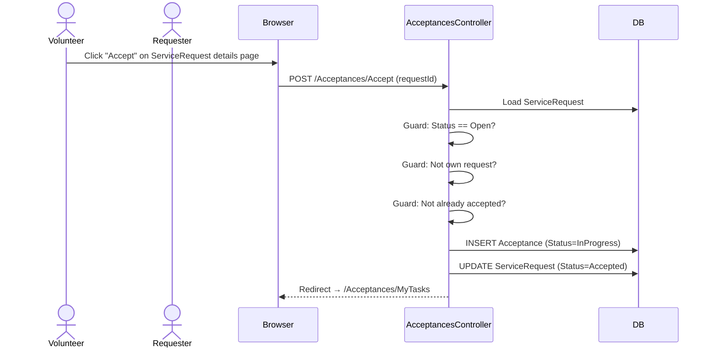
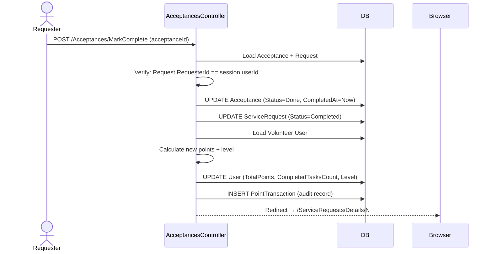

# Volunteer System — Feature Documentation

## Overview

The volunteer system manages the lifecycle from a volunteer expressing interest in a request through to task completion, point award, and rating. Primarily managed by `AcceptancesController`.

---

## Acceptance Flow



### Guards Applied Before Acceptance

| Guard | Error Message |
|-------|--------------|
| Request status must be Open | `"الطلب غير متاح"` (400 Bad Request) |
| Volunteer cannot accept own request | TempData error |
| Cannot accept same request twice | TempData error |

---

## Task Completion Flow

Only the **requester** can mark a task as complete (not the volunteer).



### Level Calculation (C# Pattern Matching)

```csharp
volunteer.Level = volunteer.TotalPoints switch
{
    < 100 => UserLevel.Newcomer,
    < 300 => UserLevel.Helper,
    < 700 => UserLevel.Trusted,
    _     => UserLevel.Champion
};
```

---

## Rating Flow

After completion (stage 6), the requester can rate the volunteer.

**Access Control:**
- Only the request's requester can submit the rating
- The rated user must be the volunteer who did the task
- Acceptance must be in `Done` status
- Duplicate rating check in controller: `_db.Ratings.Any(r => r.AcceptanceId == ... && r.FromUserId == ...)`

**Average Rating Update:**
```csharp
var avg = _db.Ratings
    .Where(r => r.ToUserId == model.ToUserId)
    .Average(r => r.Rate);
ratedUser.AverageRating = (decimal)avg;
```

The average is recalculated from all ratings, not incrementally updated — ensures accuracy.

---

## MyTasks Page

Shows all acceptances for the current volunteer, ordered by acceptance date:

```csharp
_db.Acceptances
    .Include(a => a.Request)
    .Where(a => a.VolunteerId == userId)
    .OrderByDescending(a => a.AcceptedAt)
```

---

## Points System

| Event | Points |
|-------|--------|
| Complete a 1-hour task | 20 points |
| Complete a 0.5-hour task | 10 points (minimum) |
| Complete a 5-hour task | 100 points |

Points are **never deducted**. There is no penalty mechanism.

---

## Known Limitations

| Limitation | Impact |
|-----------|--------|
| No volunteer withdrawal mechanism | A volunteer who accepted cannot un-accept |
| Only one volunteer per request | Multi-volunteer coordination not supported |
| Requester cannot reject a specific volunteer | All acceptances go through |
| `AcceptanceStatus.Pending` exists in enum but Acceptance is created as `InProgress` | Dead code / inconsistency |
