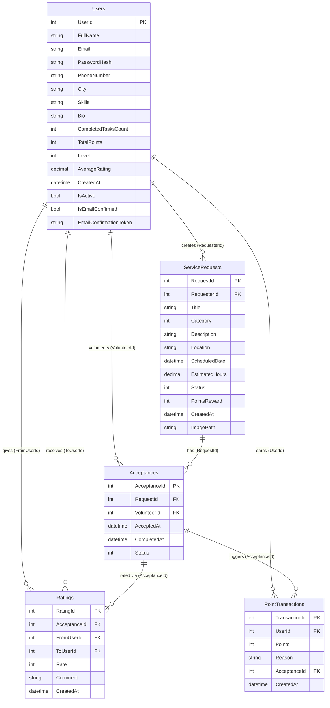

# VolunteerBridge (وصال) — Complete Technical Analysis

## 1. Project Overview

**VolunteerBridge** (Arabic name: **وصال** — "Connection") is an ASP.NET Core 8 MVC web application that connects people who need help with volunteers willing to provide it. It is a **university final project** built by a team of students, with an Arabic-first UI targeting Egypt.

### Main Goals
- Allow users to **post service requests** (help needed)
- Allow volunteers to **browse and accept** open requests
- Track task completion with a **gamification system** (points, levels, ratings)
- Provide email-based **account verification**
- Build community trust through a **mutual rating system**

### Current Completion Status: **~60% Core Features Done**

| Feature | Status |
|---------|--------|
| User Registration + Email Confirm | ✅ Complete |
| Login / Logout (Session-based) | ✅ Complete |
| Profile View / Edit | ✅ Complete |
| Create Service Request (with image) | ✅ Complete |
| Browse Open Requests | ✅ Complete |
| Accept Request (Volunteer) | ✅ Complete |
| Mark Task Complete | ✅ Complete |
| Points & Level System | ✅ Complete |
| Rating System (1-5 stars) | ✅ Complete |
| Point Transaction History | ✅ Data model exists, no UI |
| Admin Dashboard | ❌ Not implemented |
| Leaderboard | ❌ Not implemented |
| Statistics Page | ❌ Not implemented |
| Search / Filter Requests | ❌ Not implemented |
| Notifications | ❌ Not implemented |
| Admin role / authorization | ❌ Not implemented |
| Password Reset | ❌ Not implemented |

---

## 2. Tech Stack

| Layer | Technology |
|-------|-----------|
| **Framework** | ASP.NET Core 8.0 MVC |
| **Language** | C# 12 |
| **Database** | SQL Server LocalDB |
| **ORM** | Entity Framework Core 8.0.26 |
| **Auth** | Custom session-based (no ASP.NET Identity) |
| **Password Hashing** | BCrypt.Net-Next 4.1.0 |
| **Email** | MailKit 4.16.0 via Brevo SMTP |
| **Frontend** | Bootstrap 5 RTL + Tailwind CDN (landing page only) |
| **Fonts** | Rubik (Arabic), Google Material Symbols |
| **Localization** | Arabic (ar-EG) default culture |
| **IDE** | Visual Studio (scaffolded project) |

### Unused/Redundant Dependencies
- `Microsoft.AspNetCore.Identity.EntityFrameworkCore` — **referenced but never used**. Auth is fully custom.
- `FluentEmail.Mailgun` — **referenced but never used**. MailKit is used instead.
- `RestSharp` — **referenced but never used** anywhere in code.

---

## 3. Architecture Analysis

### Architecture Style
**Traditional MVC monolith** with no service layer abstraction. Controllers directly access `AppDbContext` (the EF Core DbContext) for all data operations.

```
Request → Controller → AppDbContext (EF Core) → SQL Server
                ↓
            View (Razor .cshtml)
```

### Design Patterns
| Pattern | Usage |
|---------|-------|
| MVC | Core architecture |
| Repository | ❌ Not used — controllers hit DbContext directly |
| Service Layer | ❌ Only `EmailService` exists as a standalone service |
| Dependency Injection | Minimal — DbContext + EmailService registered |
| ViewModel | Used for forms (Login, Register, CreateRequest, Rating) |

### Key Architecture Decision
The project deliberately avoids abstractions like repositories or service layers. Controllers contain all business logic inline. This is pragmatic for a university project but creates tight coupling.

---

## 4. Folder & File Breakdown

```
VolunteerBridge/
├── VolunteerBridge.sln
└── VolunteerBridge/
    ├── Program.cs                    # App entry point, DI config, middleware
    ├── VolunteerBridge.csproj        # Dependencies & target framework
    ├── appsettings.json              # Connection string + email config
    ├── appsettings.Development.json  # Dev connection string override
    ├── Controllers/
    │   ├── HomeController.cs         # Landing page + error page
    │   ├── AccountController.cs      # Register, Login, Logout, Profile, Email confirm
    │   ├── ServiceRequestsController.cs  # CRUD for help requests
    │   └── AcceptancesController.cs  # Accept task, mark complete, rate
    ├── Models/
    │   ├── User.cs                   # User entity (points, level, rating)
    │   ├── ServiceRequest.cs         # Help request entity
    │   ├── Acceptance.cs             # Volunteer acceptance of a request
    │   ├── Rating.cs                 # User-to-user rating
    │   ├── PointTransaction.cs       # Point history log
    │   ├── Enums.cs                  # UserLevel, RequestStatus, AcceptanceStatus, RequestCategory
    │   ├── AppDbContext.cs           # EF Core DbContext with Fluent API config
    │   └── ErrorViewModel.cs         # Default error model
    ├── ViewModels/
    │   ├── RegisterViewModel.cs      # Registration form
    │   ├── LoginViewModel.cs         # Login form
    │   ├── CreateRequestViewModel.cs # New request form (with image upload)
    │   └── RatingViewModel.cs        # Star rating form
    ├── Services/
    │   └── EmailService.cs           # Brevo SMTP email sender via MailKit
    ├── Views/
    │   ├── _ViewImports.cshtml       # Global using directives for views
    │   ├── _ViewStart.cshtml         # Default layout assignment
    │   ├── Shared/
    │   │   ├── _Layout.cshtml        # Main layout (Bootstrap RTL navbar)
    │   │   ├── _Layout.cshtml.css    # Layout scoped CSS
    │   │   ├── _ValidationScriptsPartial.cshtml
    │   │   └── Error.cshtml
    │   ├── Home/
    │   │   ├── Index.cshtml          # Landing page (standalone Tailwind, no layout)
    │   │   └── Privacy.cshtml
    │   ├── Account/
    │   │   ├── Register.cshtml       # Registration form
    │   │   ├── Login.cshtml          # Login form
    │   │   ├── Profile.cshtml        # User profile display
    │   │   ├── EditProfile.cshtml    # Edit profile form
    │   │   ├── ViewProfile.cshtml    # View another user's profile
    │   │   └── CheckEmail.cshtml     # "Check your email" confirmation page
    │   ├── ServiceRequests/
    │   │   ├── Browse.cshtml         # Grid of open requests
    │   │   ├── Create.cshtml         # New request form
    │   │   ├── Details.cshtml        # Request detail + action buttons
    │   │   └── MyRequests.cshtml     # User's own requests table
    │   └── Acceptances/
    │       ├── MyTasks.cshtml        # Volunteer's accepted tasks
    │       └── Rate.cshtml           # Star rating form
    ├── Migrations/                   # 3 migrations: init, email confirm, image path
    ├── wwwroot/
    │   ├── css/site.css              # Global RTL + minimal styles
    │   ├── js/site.js                # Empty (placeholder)
    │   ├── images/Register.jpg       # Registration page background
    │   ├── uploads/                  # User-uploaded request images
    │   ├── favicon.ico
    │   └── lib/                      # Bootstrap + jQuery (scaffolded)
    └── Properties/
        └── launchSettings.json       # Dev server URLs
```

---

## 5. Core Features — Deep Dive

### 5.1 User Registration & Email Confirmation
- **Files**: `AccountController.Register()`, `EmailService.cs`, `RegisterViewModel.cs`
- **Flow**: User fills form → BCrypt hashes password → GUID token generated → Confirmation email sent via Brevo SMTP → User saved to DB with `IsEmailConfirmed = false` → Redirects to `CheckEmail` page
- **Token validation**: `ConfirmEmail(string token)` looks up user by token, sets `IsEmailConfirmed = true`
- **Guard**: Login blocked if email not confirmed

### 5.2 Session-Based Authentication
- **Files**: `AccountController.Login()`, `Program.cs` (`AddSession()`)
- **Mechanism**: `HttpContext.Session.SetInt32("UserId", ...)` + `SetString("UserName", ...)`
- **No ASP.NET Identity**: Despite the NuGet reference, auth is 100% custom
- **No role system**: No admin role exists. Any user can access any controller.
- **Session timeout**: Uses default ASP.NET session settings (20 min idle)

### 5.3 Service Request Lifecycle
```
Open → (Volunteer accepts) → Accepted → (Requester marks complete) → Completed
  ↓                                                                       ↓
Cancelled                                                          Rating + Points
```
- **Create**: Requester fills form, optional image upload to `wwwroot/uploads/`
- **Browse**: Shows all `Status == Open` requests with cards
- **Accept**: Volunteer clicks "Accept" → creates `Acceptance` record, changes status to `Accepted`
- **Complete**: Only the requester can mark complete → awards points to volunteer, recalculates level
- **Cancel**: Only the requester can cancel while still `Open`
- **Points formula**: `Math.Max(10, (int)(EstimatedHours * 20))`

### 5.4 Gamification System
- **Levels** (in `Enums.UserLevel`):
  - Newcomer (0-99 pts), Helper (100-299), Trusted (300-699), Champion (700+)
- **Level recalculation**: Done inline in `AcceptancesController.MarkComplete()` using switch expression
- **PointTransaction**: Records every point award with reason and acceptance link

### 5.5 Rating System
- **Flow**: After task completion, requester rates volunteer (1-5 stars + optional comment)
- **Duplicate prevention**: Server-side check + UI disables button after rating
- **Average recalculation**: Computed on-the-fly from all ratings for that user
- **One-directional**: Only requester → volunteer (volunteer cannot rate requester)

---

## 6. API Analysis (All Routes)

All routes follow the default MVC convention: `/{Controller}/{Action}/{id?}`

| Route | Method | Purpose | Auth Required |
|-------|--------|---------|--------------|
| `/Home/Index` | GET | Landing page | No |
| `/Home/Privacy` | GET | Privacy page | No |
| `/Account/Register` | GET/POST | User registration | No |
| `/Account/Login` | GET/POST | User login | No |
| `/Account/Logout` | GET | Clear session | No |
| `/Account/Profile` | GET | View own profile | Session |
| `/Account/EditProfile` | GET/POST | Edit own profile | Session |
| `/Account/ViewProfile/{id}` | GET | View another user | No |
| `/Account/ConfirmEmail?token=` | GET | Email confirmation | No |
| `/Account/CheckEmail` | GET | "Check email" page | No |
| `/ServiceRequests/Browse` | GET | All open requests | No |
| `/ServiceRequests/MyRequests` | GET | User's requests | Session |
| `/ServiceRequests/Create` | GET/POST | Create request | Session |
| `/ServiceRequests/Details/{id}` | GET | Request details | No |
| `/ServiceRequests/Cancel/{id}` | POST | Cancel request | Session + Owner |
| `/Acceptances/Accept` | POST | Accept a request | Session |
| `/Acceptances/MyTasks` | GET | Volunteer's tasks | Session |
| `/Acceptances/MarkComplete` | POST | Mark task done | Session + Requester |
| `/Acceptances/Rate` | GET/POST | Rate volunteer | Session + Requester |

> [!WARNING]
> **No `[Authorize]` attributes anywhere.** Auth checks are manual `Session.GetInt32("UserId") == null` redirects. Any unauthenticated user can access Browse, Details, ViewProfile without restriction (which is intended), but there's no middleware-level protection.

---

## 7. Database Analysis

### Entity-Relationship Diagram


### Delete Behaviors
| Relationship | On Delete |
|-------------|-----------|
| User → ServiceRequests | Restrict |
| ServiceRequest → Acceptances | Cascade |
| User → Acceptances | Restrict |
| Acceptance → Ratings | Cascade |
| User → Ratings (From/To) | Restrict |
| User → PointTransactions | Cascade |
| Acceptance → PointTransactions | SetNull |

### Migrations (3 total)
1. `20260430_init` — All 5 tables + relationships
2. `20260502_AddEmailConfirmation` — Added `IsEmailConfirmed`, `EmailConfirmationToken` to Users
3. `20260508_AddImagePathToServiceRequest` — Added `ImagePath` to ServiceRequests

---

## 8. Authentication & Security

### Current Auth Mechanism
- **Session-based** with `HttpContext.Session`
- Password hashed with **BCrypt** (secure)
- Email confirmation via **GUID token**

### Security Concerns

| Issue | Severity | Details |
|-------|----------|---------|
| No `[Authorize]` middleware | 🔴 High | All auth is manual session checks; easy to miss |
| No CSRF on Accept endpoint | 🔴 High | `Accept(int requestId)` has no `[ValidateAntiForgeryToken]` |
| No admin role system | 🟡 Medium | No way to distinguish admin from regular user |
| Email password in appsettings | 🟡 Medium | Password field empty but structure exposes credentials |
| Hardcoded connection string in OnConfiguring | 🟡 Medium | Fallback connection string in `AppDbContext` |
| No rate limiting | 🟡 Medium | No protection against brute force login |
| EditProfile accepts UserId from form | 🔴 High | User could modify another user's profile by changing hidden field |
| Session fixation possible | 🟡 Medium | No session regeneration after login |
| No HTTPS enforcement in dev | 🟠 Low | HTTP profile available |

---

## 9. Dependency Injection Map

```csharp
// Program.cs — All registered services:
builder.Services.AddControllersWithViews();     // MVC framework
builder.Services.AddSession();                  // Session state
builder.Services.AddScoped<EmailService>();      // Email sender
builder.Services.AddDbContext<AppDbContext>();    // EF Core context
builder.Services.AddLocalization();              // Arabic locale
```

That's it — only **3 custom registrations**. No interfaces, no abstractions.

---

## 10. Configuration & Environment

| File | Purpose |
|------|---------|
| `appsettings.json` | Connection string (LocalDB), Email SMTP settings (Brevo) |
| `appsettings.Development.json` | Dev connection string override |
| `launchSettings.json` | HTTP (5294) and HTTPS (7127) ports |
| User Secrets ID | `c3821c40-1a7a-490c-a94f-7b0a9c8a4c40` (email password likely stored here) |

---

## 11. Missing / Incomplete Parts

### ❌ Not Implemented (confirmed by code analysis)
1. **Admin Dashboard** — No `AdminController`, no admin views, no admin role
2. **Leaderboard** — No `LeaderboardController`, no ranking page
3. **Statistics** — No statistics controller or aggregation queries
4. **Points History UI** — `PointTransaction` model exists but no view to display it
5. **Search / Filter** — Browse shows all open requests, no filtering
6. **Notifications** — No notification system
7. **Password Reset** — No "forgot password" flow
8. **Volunteer-to-Requester Rating** — Rating is one-directional only
9. **Multiple Volunteers per Request** — Only first acceptance is used; no selection mechanism
10. **User Skills Matching** — `Skills` field exists on User but is never used for matching
11. **Helpers folder** — Referenced in open editor tabs but doesn't exist in repo

### 🐛 Potential Bugs
1. **EditProfile vulnerability**: `EditProfile(User model)` uses `model.UserId` from the form — attacker could change another user's data
2. **No unique email constraint in DB**: Only checked in code, not enforced at database level
3. **`pointTransactions` DbSet name**: lowercase `p` — inconsistent with C# naming conventions
4. **Accept doesn't prevent self-acceptance**: A user can volunteer for their own request
5. **Accept doesn't prevent duplicate acceptance**: Multiple volunteers could accept the same request
6. **MarkComplete uses `DateTime.Now`** instead of `DateTime.UtcNow` — inconsistent with model defaults
7. **Rate redirect goes to MyTasks**: After rating, requester lands on volunteer's task page which may confuse

---

## 12. Code Quality Review

| Aspect | Rating | Notes |
|--------|--------|-------|
| **Separation of Concerns** | ⭐⭐ | Controllers contain all business logic |
| **Consistency** | ⭐⭐⭐ | Mostly consistent naming and patterns |
| **Reusability** | ⭐⭐ | No shared helpers or base classes |
| **Security** | ⭐⭐ | BCrypt is good; session auth is weak |
| **Error Handling** | ⭐⭐ | Minimal try-catch, only in email |
| **Validation** | ⭐⭐⭐ | Data annotations present, server-side checks exist |
| **UI Consistency** | ⭐⭐ | Landing page uses Tailwind; rest uses Bootstrap — two different design systems |
| **Code Comments** | ⭐⭐⭐ | Mix of Arabic + English comments, generally helpful |
| **Testability** | ⭐ | No tests, no interfaces, not testable |

---

## 13. Application Flow (Request Lifecycle)

```
1. HTTP Request arrives
2. ASP.NET Core routing matches {Controller}/{Action}/{id?}
3. Session middleware loads session data (UserId, UserName)
4. Controller action executes:
   a. Manual session check (if auth needed)
   b. Direct EF Core queries via _db (AppDbContext)
   c. Business logic inline in controller
   d. Returns View() with model
5. Razor view renders HTML
6. Response sent to browser
```

---

## 14. Collaboration Guide

### Safe to Work On (Independent)
- **New controllers** (Leaderboard, Admin, PointsHistory) — completely independent
- **New views** — add new `.cshtml` files without touching existing ones
- **CSS/styling** — `site.css` or new CSS files
- **New ViewModels** — additive, no conflicts

### Tightly Coupled — Handle With Care
- `_Layout.cshtml` — shared by all non-landing pages (navbar changes affect everyone)
- `AppDbContext.cs` — any schema change requires migration coordination
- `AcceptancesController.MarkComplete()` — contains points + level logic that other features depend on
- `Program.cs` — DI registrations, middleware order

### Onboarding Order for New Developer
1. Read `Models/Enums.cs` + all entity models
2. Read `Models/AppDbContext.cs` (relationships)
3. Read `Program.cs` (DI + middleware)
4. Trace the full lifecycle: `AccountController.Register` → `Login` → `ServiceRequestsController.Create` → `AcceptancesController.Accept` → `MarkComplete` → `Rate`
5. Read the views in the same order

---

## 15. Suggested Next Steps

### Priority 1 — Complete Core Features
1. **Admin Dashboard** — Create `AdminController` with user/request management
2. **Leaderboard** — Query `Users` ordered by `TotalPoints DESC`
3. **Points History** — Simple view listing `PointTransactions` for current user

### Priority 2 — Security Fixes
1. Add `[Authorize]`-equivalent session filter or middleware
2. Fix `EditProfile` to use session UserId instead of form-submitted UserId
3. Add unique email constraint in database migration
4. Add `[ValidateAntiForgeryToken]` to `Accept` endpoint
5. Prevent self-acceptance and duplicate acceptance

### Priority 3 — UX Improvements
1. Add search/filter to Browse page
2. Unify design system (pick Bootstrap OR Tailwind, not both)
3. Add pagination to lists
4. Add loading states and better error messages

### Priority 4 — Technical Debt
1. Remove unused NuGet packages (FluentEmail.Mailgun, RestSharp, Identity.EFC)
2. Fix `pointTransactions` DbSet naming
3. Extract level calculation logic to a shared helper
4. Add `async` to all database operations (many are synchronous)

---

## 16. Quick Start For Me

### Easiest Entry Point
Start with **`Models/Enums.cs`** — it defines the entire domain vocabulary in 66 lines.

### Most Important Files to Read First
1. [Enums.cs](file:///d:/Faculty%20Things/Software%20Dev/FinalProject/VolunteerBridge/VolunteerBridge/Models/Enums.cs) — domain vocabulary
2. [User.cs](file:///d:/Faculty%20Things/Software%20Dev/FinalProject/VolunteerBridge/VolunteerBridge/Models/User.cs) — central entity
3. [AppDbContext.cs](file:///d:/Faculty%20Things/Software%20Dev/FinalProject/VolunteerBridge/VolunteerBridge/Models/AppDbContext.cs) — all relationships
4. [Program.cs](file:///d:/Faculty%20Things/Software%20Dev/FinalProject/VolunteerBridge/VolunteerBridge/Program.cs) — app configuration
5. [AcceptancesController.cs](file:///d:/Faculty%20Things/Software%20Dev/FinalProject/VolunteerBridge/VolunteerBridge/Controllers/AcceptancesController.cs) — most complex business logic

### Execution Flow to Trace First
```
Register → Login → Create Request → Browse → Accept → MarkComplete → Rate
```
This single flow touches every entity, every controller, and every major feature.

### Beginner Roadmap
1. **Week 1**: Understand the 5 models, trace the full lifecycle above
2. **Week 2**: Build Leaderboard (read-only, simple query, new controller + view)
3. **Week 3**: Build Admin Dashboard (read-only stats first, then management)
4. **Week 4**: Add Points History page, search/filter on Browse
5. **Week 5**: Security hardening, code cleanup, testing

---

## 17. Build & Run Instructions

```bash
# Prerequisites: .NET 8 SDK, SQL Server LocalDB

# 1. Clone and navigate
cd "d:\Faculty Things\Software Dev\FinalProject\VolunteerBridge"

# 2. Restore dependencies
dotnet restore

# 3. Apply migrations (creates database)
dotnet ef database update --project VolunteerBridge

# 4. Run the application
dotnet run --project VolunteerBridge

# 5. Open browser
# HTTP:  http://localhost:5294
# HTTPS: https://localhost:7127
```

> [!NOTE]
> Email confirmation requires a valid Brevo SMTP password in User Secrets or `appsettings.json`. Without it, registration will fail at the email step.
